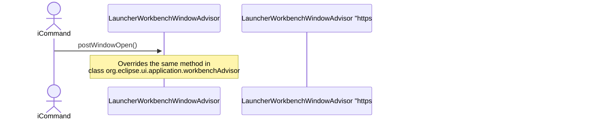

# PHP-projects

```mermaid
sequenceDiagram
  actor iCommand
  participant LauncherWorkbenchWindowAdvisor

  iCommand->>+LauncherWorkbenchWindowAdvisor: postWindowOpen()
  Note over LauncherWorkbenchWindowAdvisor: Overrides the same method in <br/> class org.eclipse.ui.application.workbenchAdvisor

  link LauncherWorkbenchWindowAdvisor "https://github.cerner.com/ibus-core/ibus-patient-client/blob/master/src/main/java/com/cerner/ibus/patient/model/Allergy.java"
```
