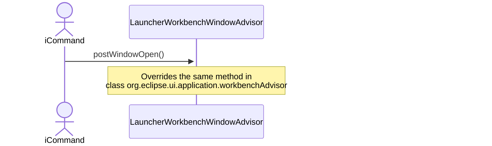

# PHP-projects

```mermaid
sequenceDiagram
  actor iCommand
  participant LauncherWorkbenchWindowAdvisor

  iCommand->>+LauncherWorkbenchWindowAdvisor: postWindowOpen()
  Note over LauncherWorkbenchWindowAdvisor: Overrides the same method in <br/> class org.eclipse.ui.application.workbenchAdvisor

   link LauncherWorkbenchWindowAdvisor: {"Dashboard": "https://dashboard.contoso.com/alice", "Wiki": "https://wiki.contoso.com/alice"}

```
